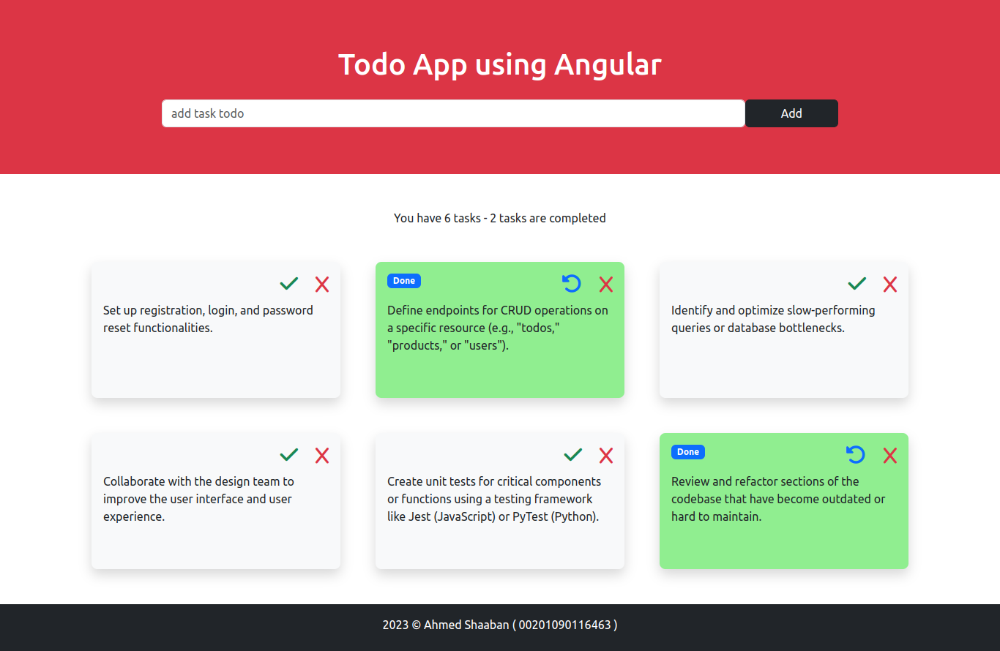

# Todo App - Angular and Bootstrap



This is a simple Todo application built using Angular and Bootstrap. It allows users to manage their tasks by adding, marking as complete, undoing, and deleting them. Additionally, the app displays an alert if the todo text is less than 10 characters and prompts for confirmation before deleting a todo.

## Features

- Add new todos.
- Mark todos as complete.
- Undo completed todos.
- Delete todos with confirmation.
- Alert for short todo text (< 10 characters).

## Getting Started

Follow these instructions to get a copy of the project up and running on your local machine for development and testing purposes.

### Prerequisites

- [Node.js](https://nodejs.org/) (LTS version recommended)
- [Angular CLI](https://angular.io/cli)

### Installation

1. Clone the repository:

   ```
   git clone https://github.com/ahmedshaaban1608/todo-angular-ui.git
   ```

2. Install project dependencies:

   ```
   npm install
   ```

## Running the Application

1. Start the development server:

   ```
   ng serve
   ```

2. Open your browser and navigate to http://localhost:4200/ to access the Todo App.

## Usage

- Adding a Todo: Enter your todo text in the input field and click the "Add" button. An alert will be displayed if the text is less than 10 characters.

- Marking as Complete/Undo: Click the checkbox next to a todo to mark it as complete. Click it again to undo the completion.

- Deleting a Todo: Click the "Delete" icon to delete a todo. A confirmation modal will appear before deletion.

## Built With

- Angular - The web framework used
- Bootstrap - Front-end CSS framework
- ng-bootstrap - Angular Bootstrap components

## Contributing

Contributions are welcome! Please feel free to open issues or pull requests.

## Acknowledgments

Thanks to the Angular and Bootstrap communities for their excellent documentation and resources.
